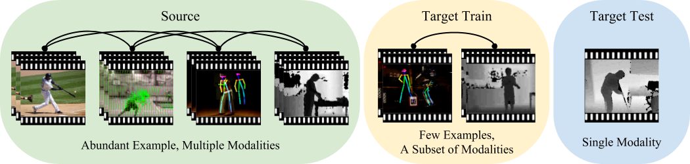

# Graph Distillation



This is the code for the paper
**[Graph Distillation for Action Detection with Privileged Modalities](https://arxiv.org/abs/1712.00108)**
presented at [ECCV 2018](https://eccv2018.org/)

*Please note that this is not an officially supported Google product.*

In this work, we propose a method termed **graph distillation** that incorporates rich privileged information from a large-scale multi- modal dataset in the source domain, and improves the learning in the target domain where training data and modalities are scarce.

If you find this code useful in your research then please cite

```
@inproceedings{luo2018graph,
  title={Graph Distillation for Action Detection with Privileged Modalities},
  author={Luo, Zelun and Hsieh, Jun-Ting and Jiang, Lu and Niebles, Juan Carlos and Fei-Fei, Li},
  booktitle={ECCV},
  year={2018}
}
```

## Setup
All code was developed and tested on Ubuntu 16.04 with Python 3.6 and PyTorch 0.3.1.


## Pretrained Models
We can download pretrained models used in our paper running the script:

```
sh scripts/download_models.sh
```

Or alternatively you can download Cloud SDK

1. Install Google Cloud SDK (https://cloud.google.com/sdk/install)
2. Copy the pretrained model using the following commands:

```
gsutil -m cp -r gs://graph_distillation/ckpt .
```


## Running Models
We can use the scripts in `scripts/` to train models on different modalities.


### Classification
See `classification/run.py` for descriptions of the arguments.

`scripts/train_ntu_rgbd.sh` trains a model for a single modality.

`scripts/train_ntu_rgbd_distillation.sh` trains model with graph distillation. The modality being trained is specified by the `xfer_to` argument, and the modalities to distill from is specified in the `modalities` argument.

### Detection
See `detection/run.py` for descriptions of the arguments. Note that the `visual_encoder_ckpt_path` argument is the pretrained visual encoder checkpoint, which should be from training classification models.

`scripts/train_pku_mmd.sh` trains a model for a single modality.

`scripts/train_pku_mmd_distillation.sh` trains model with graph distillation. The modality being trained is specified by the `xfer_to` argument, and the modalities to distill from is specified in the `modalities` argument.
